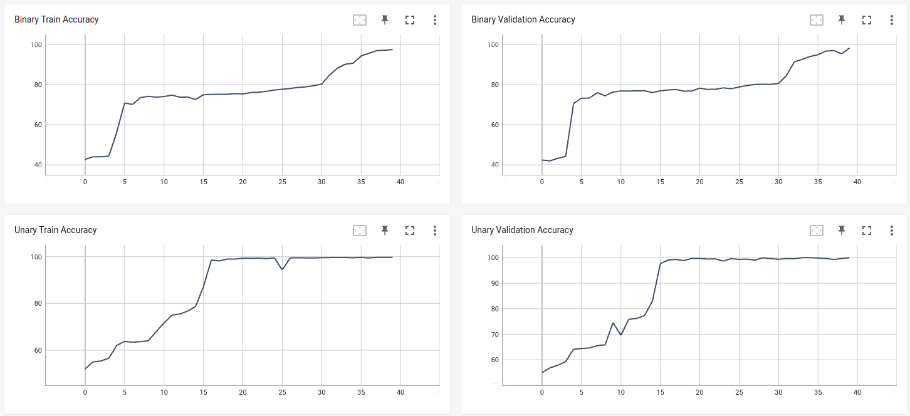

# Relational Networks for VQA

 Mohit Mehta(mm12318)&nbsp;&nbsp;&nbsp; Umang Shah(uks8451)&nbsp;&nbsp;&nbsp; Surya Narayana(sn3402)
<hr>


## Dataset
The dataset used for VQA generally comprises images and questions that can be answered from the image. The question can broadly be classified into 
1. Relational : 
What is the shape of the object that is farthest from the gray object? or non-relational  
2. Non-Relational : 
What is the shape of the gray object.

### Difficulties: 
Most Visual QA datasets have the following issues which make them training for VQA models difficult.

1. Full vocabulary is not known
2. Require knowledge about the real world that cannot be captured in the training data
3. Contain Ambiguities and linguistic biases which are then carried into the model.
### Solution: CLEVR
To avoid these issues, the CLEVR dataset was proposed which contains 3D-rendered objects such as spheres, cubes and cylinders having different (not distinct) colors.

Queries are formed that require understanding attributes such as location, shape, color and material.

e.g: Is the cube the same material as the cylinder? What is the color of the sphere? 

### Implementation Used: Sort-of-CLEVR
Dataset generated randomly that differs on following aspects from CLEVR datset

1. Separates relational and non-relational questions.
2. Images contain 2D objects
3. Each image has 6 objects of randomly chosen shape (square or circle)
4. Each object in an image will have distinct color from the set of 6 colors (red, blue, green, orange, yellow, gray)
5. Questions are hard-coded as fixed-length binary strings to avoid NLP-related complexities and errors
6. 10 relational and 10 non-relational questions for each image.


## Relational Networks: 
Relational Networks are neural networks that can be mathematically described by equation stated below.
    $$ RN(O) = f_{\phi} (\Sigma_{i,j}g_{\theta}(o_i,o_j)) $$
    where
    $$O = \{ o_1, o_2, o_3, . . .o_n \}$$
    $ f_{\phi} $ and $ g_{\theta} $ are functions which will be MLPs with $\phi$ and $\theta$ being synaptic weights learned by the model

The output of $g_{\theta}$ infers if the two objects passed are related and in what way, thus aptly called 
a relation.

Relational Networks have three notable strengths:
1. They infer relations <br/>
- Since they operate on all pairs, they do not need to know beforehand which objects are related. 
2. Data efficient (Also makes them good candidates to be used in one-shot learnings )<br/>
- RNs use only one function for computing relations where input is object-object pair and thus can better generalize relations.
- In contrast, if a traditional MLP approach were all $n$ objects are passed at once as input, it would have to learn and embed $n^2$ functions resulting in a high cost of learning for $n^2$ feedforward passes 

2. Order invariant ( Since they operate on a set of objects)<br/>
- This is ensured by the summation in the functional form.
- Also ensures that the output of RN contains information on relations that generally exist in the object set.

## Models

The paper discusses three models which differ by the input provided to them
### 1. Pixels 

Since inherently RN cannot deal with pixels, CNN is used to infer a set of objects from the input. 

Input images are of size 128 x 128 which are convolved through 4 layers to generate <I>k</I> feature map of size <I>d x d</I>. 

The current implementation uses <I>k = 24</I> and <I>d = 3</I>
with <I>stride = 2</I>  and <I>padding = 1</I> used at each level. Batch Normalization is also used here to ensure all features are processed equally disregarding the scale of values. This also acts as a way of regularizing thus eliminating the need for dropouts. This also makes the model less delicate to hyperparameter (learning rate). 

ReLu was used as non-linearity applied after batch-norm in this implementation.

snippet: 
```
class ConvInputModel(nn.Module):
    def __init__(self):
        super(ConvInputModel, self).__init__()
        
        self.conv1 = nn.Conv2d(3, 24, 3, stride=2, padding=1)
        self.batchNorm1 = nn.BatchNorm2d(24)
        self.conv2 = nn.Conv2d(24, 24, 3, stride=2, padding=1)
        self.batchNorm2 = nn.BatchNorm2d(24)
        self.conv3 = nn.Conv2d(24, 24, 3, stride=2, padding=1)
        self.batchNorm3 = nn.BatchNorm2d(24)
        self.conv4 = nn.Conv2d(24, 24, 3, stride=2, padding=1)
        self.batchNorm4 = nn.BatchNorm2d(24)

        
    def forward(self, img):
        """convolution"""
        x = self.conv1(img)
        x = F.relu(x)
        x = self.batchNorm1(x)
        x = self.conv2(x)
        x = F.relu(x)
        x = self.batchNorm2(x)
        x = self.conv3(x)
        x = F.relu(x)
        x = self.batchNorm3(x)
        x = self.conv4(x)
        x = F.relu(x)
        x = self.batchNorm4(x)
        return x
```
The output is of size : batch_size x k x (d + 2 x padding) x (d + 2 x padding)

It is important to know that the positions of each object are arbitrarily assigned by the RN and not something learned by the CNN.

### 2. State Description

since the RN does not take pixels of an image as input anyway, Input can be described by specifying the shape, color, x_coordinate, y_coordinate, etc of each object in the object-object pair as a vector. 

### 3. Question

The type of relations learned by RN should depend on the question aswell. The implementation modifies the RN architecture that can be functionally represented below. where q denotes the question embeddings. 

$$ RN(O) = f_{\phi} (\Sigma_{i,j}g_{\theta}(o_i,o_j,q)) $$


The question embeddings can be generated using LSTM. A vocabulary should be created so that each word from the question can be assigned a unique integer enabling the LSTM to generate the question embedding.

At each timestep, 1 word from the sentence is passed as input to LSTM. LSTM here makes sense due to their ability to memorize important stuff. By propagating the final state of LSTM to RN we ensure this memory is passed to RN. 

For the current implementation, Sort-of-ClLEVR saves these embeddings eliminating the need for LSTM. These are used to get the desired accuracy with the CNN+RN model. For the state description model LSTM was used anyway.

### 4. Natural Language

For datasets such as bAbI, where information about the object also needs to be extracted from text, the paper suggests identifying about 20 sentences as support sets which were immediately before the probe question. These sentences were also tagged with the position they occurred relative to the question and processed word by word using LSTM. 

## Implementations

### Task 1: CNN + RN
- Here we take image + question embedding as input.
- The CNN implementation to extract object information from images is as discussed above. 

- Creating pairs from object set. <br/>
    Each object of size 25 x 26 is mapped to every other object of the same shape. And al such object pairs from all images in batch along with the question embeddings are eventually converted into a tensor of shape 40000 x 70 which are then passed to the relation operation.

- relation $g_{\theta}$ <br/>
In our implementation, the relation part of our RNN consists of 4 fully connected neural layers having the dimensions as discussed below
    - Layer 1: <br/>
    Input: (batch_size * (24+2) * 2+18 ) x 70
    where 24 is the number of kernels, 2 is the size coordinate representation for the object. This is multiplied by 2 since we process pair of objects at a go. 18 is the size of the embedding for the question.<br/>
    Output: 256

    - Layer 2 - 4: <br/>
    Input = Output = batch_size x 256
    ```# initialized in model
    if self.relation_type == 'ternary':
            ##(number of filters per object+coordinate of object)*3+question vector
            self.g_fc1 = nn.Linear((24+2)*3+18, 256)
        else:
            ##(number of filters per object+coordinate of object)*2+question vector
            self.g_fc1 = nn.Linear((24+2)*2+18, 256)

        self.g_fc2 = nn.Linear(256, 256)
        self.g_fc3 = nn.Linear(256, 256)
        self.g_fc4 = nn.Linear(256, 256)

        
    ```
- Summation of $g_{\theta}$ over set $O$

    Summation is done over each batch for all object pairs resulting in an object if size batch_size x 256

    ``` # part of training process
    if self.relation_type == 'ternary':
            x_g = x_.view(mb, (d * d) * (d * d) * (d * d), 256)
        else:
            x_g = x_.view(mb, (d * d) * (d * d), 256)

        x_g = x_g.sum(1).squeeze()
    ```

- $f_{\phi}$ <br/>
Single layer with input = output = 256
    ```
    self.f_fc1 = nn.Linear(256, 256)
    ```
- Output Layer: <br>
    A fully connected network of 2 layers is used to get the final output from the model

    - Layer1: <br/>
    input: 64 x 256<br/>
    output: 64 x 256

    - dropout: 0.5

    - Layer2: <br/>
    input: 64 x 256<br/>
    output: 64 x 10<br/>

    - Log Soft Max (Converting Regression to Classification)
    output: 64 x 10

    ```
    class FCOutputModel(nn.Module):
        def __init__(self):
            super(FCOutputModel, self).__init__()

            self.fc2 = nn.Linear(256, 256)
            self.fc3 = nn.Linear(256, 10)

        def forward(self, x):
            x = self.fc2(x)
            x = F.relu(x)
            x = F.dropout(x)
            x = self.fc3(x)
            ans = F.log_softmax(x, dim=1)
            return ans
    ```
- Optimizer: <br/>
    The CNN + RN is trained using adam Gradient Descent Optimizer end to end

- Tuning of model:

    When setting the seed value to 42 with a learning rate = 0.0001,  an accuracy of 97% on training data and 91%  on test data was achieved for relational questions after 40 epochs.

    Similarly, an accuracy of 99% was achieved on both test and training data for the non-relational model

    Non relational accuracy over epoch.
    

    Relational accuracy over epoch
    

    [CSV for relational train accuracy](csvs/run-Dec02_04-41-09_1fb17b539b50_Accuracy_train_unary-tag-Accuracy_train.csv)

    [CSV for relational test accuracy](csvs/run-Dec02_04-41-09_1fb17b539b50_Accuracy_test_unary-tag-Accuracy_test.csv)

    [CSV for non-relational train accuracy](csvs/run-Dec02_04-41-09_1fb17b539b50_Accuracy_train_binary-tag-Accuracy_train.csv)

    [CSV for non-relational test accuracy](csvs/run-Dec02_04-41-09_1fb17b539b50_Accuracy_test_binary-tag-Accuracy_test.csv)

- Other attempts at tuning

    When training the model with a higher learning rate (0.0005), It took 60 epochs for the accuracies to stabilize to (3% in the test and 96% on training data. 
    
    Since we achieve a good enough accuracy with low epochs, we consider afore mentioned result as a more practical outcome. 
### Task 2: State Description + LTSM + RN
In this task, we take a state description as input instead of an image. This eliminates the need for CNN as this information can directly be processed by RNN. 

- Since we are training on SORT-Of-CLEVR, the state description for each image will have 6 rows with the following columns center_x, center_y, shape, and color. All text values are replaced by integers starting from 1 by creating appropriate vocabularies.

- Each object can be described in 4 numeric values. These are then passed to the RN model.

- For the question part, instead of using question embedding directly from SORT-Of-CLEVR, we generate them using LSTM which is a vector of size 128.

- This task avoids the complexities and errors arising due to CNN but introduces NLP-related complexities.


LSTM

- As per the recommendation from the paper, LSTM was implemented having the following configurations.
    - Questions are passed to LSTM with shape batch_size x w x v, where w is the number of tokens in question and v is the size of vocab (39)
    - The hidden state is of size 128.
    - Randomly generated integers for the weights of initial state h0 ( the hidden state at the zeroth timestamp), c0 (the cell state at the zeroth timestamp). Alternatively, these can also be initialized with zeros.
    - The output of this LSTM would be a vector of shape BATCH_SIZE x 128

RN 
- RN in this case only differs from task 1 in terms of input. 

- The input layer will take a vector of shape
(batch_size * 6 * 6) x 4

- Subsequent hidden layers will stay of same dimensions as before (task 1)

- The output layer is of dimension batch_size x vocab_size.

Tuning

- The initial learning to start the tuning was determined using the "Bayesian Method" provided by PyTorch-lightning APIs. 
- The initial learning rate determined by the above approach was approx. <b>0.0003</b> resulting in training and testing accuracy of around <b>94%</b> after <b>40</b> epochs.



- All further explorations performed either similar or poorer than the results above.